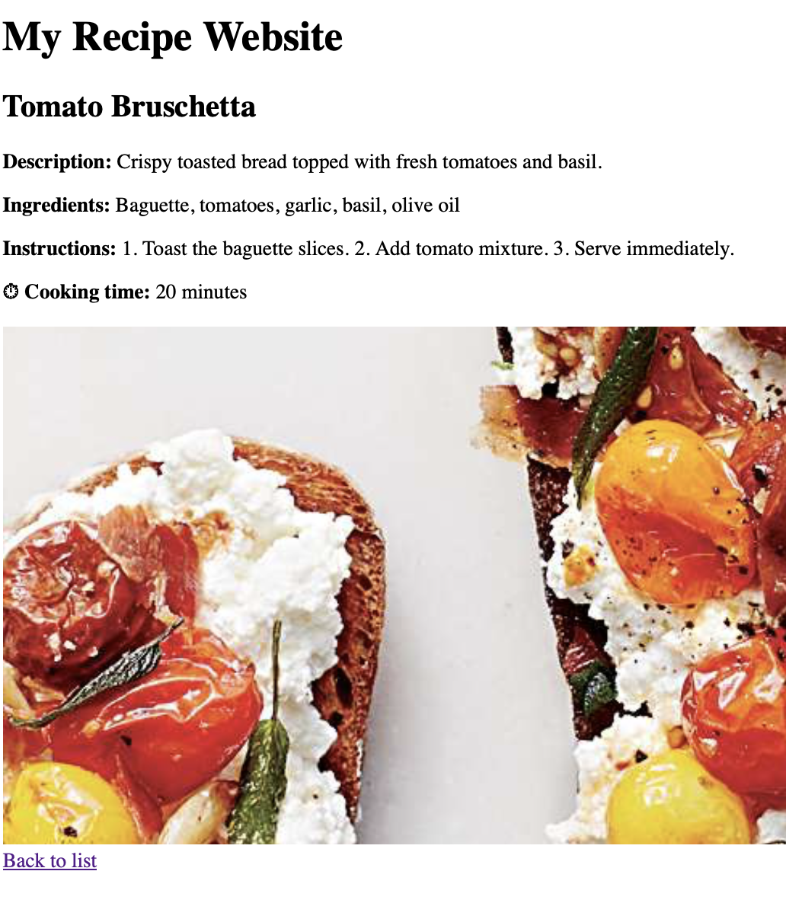
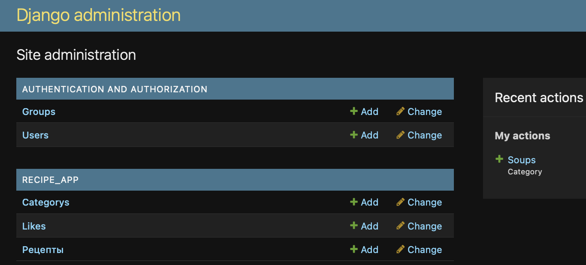

# Recipe Website

A Django web application where users can create, manage, and share cooking recipes.

The project demonstrates full-stack Django development including authentication, CRUD operations, media uploads, and a REST API.

---

## Features

* User registration, login, and logout
* Create, edit, and delete recipes
* Archive and restore recipes
* Like recipes
* Upload recipe images
* Filter recipes by category
* Random recipes on the homepage
* User profile with personal recipes
* Django Admin management
* REST API for recipes
* API documentation (Swagger / Redoc)

---

## Tech Stack

### Backend

* Python 3.10+
* Django 5.x
* Django REST Framework

### Frontend

* HTML
* Bootstrap

### Database

* SQLite (development)
* PostgreSQL via `DATABASE_URL` (production)

### Other

* Django Filters
* DRF YASG (Swagger API documentation)

---

# Project Structure

```bash
RecipesPythonDjango/
│
├── manage.py
├── requirements.txt
├── README.md
│
├── recipe_site/
│   ├── mysite/
│   │   ├── settings.py
│   │   ├── urls.py
│   │   └── wsgi.py
│   │
│   ├── recipe_app/
│   │   ├── models.py
│   │   ├── views.py
│   │   ├── forms.py
│   │   ├── urls.py
│   │   ├── admin.py
│   │   │
│   │   └── templates/recipe_app/
│   │       ├── base.html
│   │       ├── recipes_list.html
│   │       ├── recipe_detail.html
│   │       ├── create_recipe.html
│   │       ├── update_recipe.html
│   │       ├── confirm_delete.html
│   │       └── confirm_archive.html
│   │
│   └── user_app/
│       ├── views.py
│       ├── forms.py
│       ├── urls.py
│       │
│       └── templates/user_app/
│           ├── login.html
│           ├── signup.html
│           └── profile.html
│
└── fixtures/
    └── recipes.json
```

---

# Installation

## Clone the repository

```bash
git clone https://github.com/Vereneya-aya/recipe-site.git
cd RecipesPythonDjango
```

## Create and activate a virtual environment

```bash
python -m venv .venv
source .venv/bin/activate
```

### Windows

```bash
.venv\Scripts\activate
```

## Install dependencies

```bash
pip install -r requirements.txt
```

## Run database migrations

```bash
python manage.py migrate
```

## Create an admin user

```bash
python manage.py createsuperuser
```

## Load sample data (optional)

```bash
python manage.py loaddata fixtures/recipes.json
```

## Run the development server

```bash
python manage.py runserver
```

Open in browser:

```
http://127.0.0.1:8000/
```

---

# API Endpoints

Main API routes:

```
/api/
/api/recipes/
/api/categories/
```

Interactive API documentation:

### Swagger UI

```
/swagger/
```

### Redoc

```
/redoc/
```

---

# Deployment

The project can be deployed using platforms such as:

* Railway
* Render
* Fly.io

Production setup uses environment variables and `DATABASE_URL` for PostgreSQL configuration.

---

# Author

**Veranika Lis**
Python / Django Developer

---

## Screenshots

### Home Page


### Recipe Detail


### Admin Panel


---
Live Demo: https://your-app.onrender.com